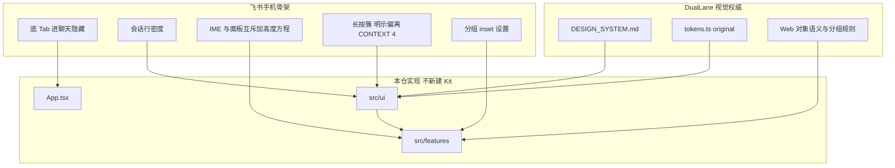
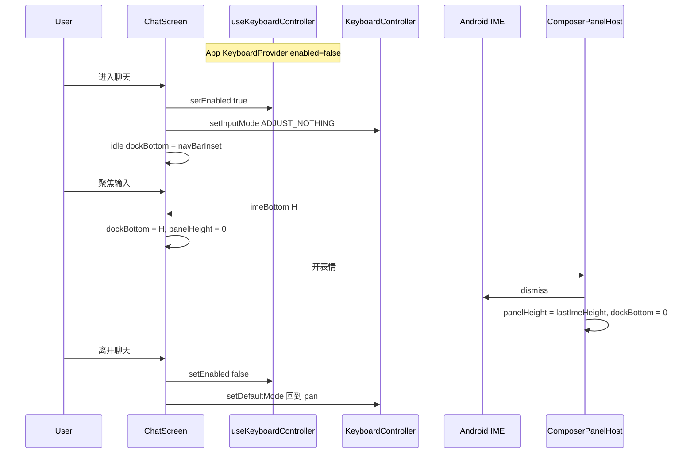
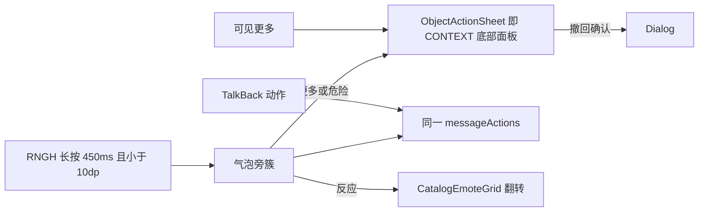
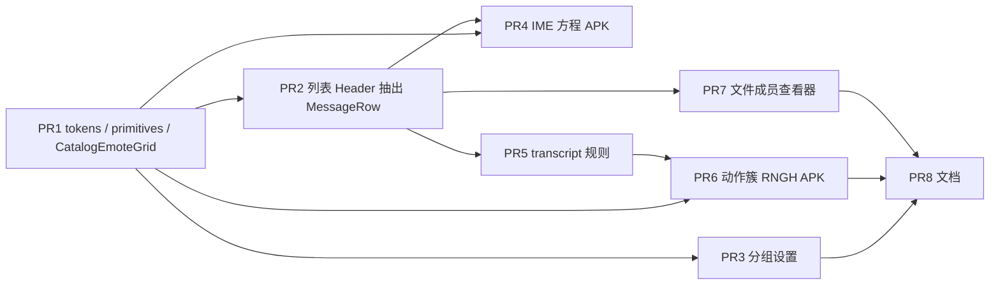

# DualLane Android 体验全面迭代（组件 / 聊天 / 动效）

| 字段 | 值 |
| --- | --- |
| 作者 | DualLane mobile design |
| 日期 | 2026-09-18 |
| 状态 | Draft（2026-09-18 产品决策已冻结） |
| 实现树 | `D:\Project\duallane-mobile-redesign` |
| 主仓 | `D:\Project\duallane` |
| 对照 APK | internal-0.2.0-20260918-6 |
| 移动主线参考 | 约 `199d055`（品牌图标 + 登录邀请降权） |
| 视觉权威 | 主仓「清晰双轨」设计系统 |
| 布局参考 | 飞书 / Lark **手机端信息架构与手势**（不是品牌色、Logo 或文案） |

---

## Overview

R1 壳层与 R2 聊天协议已经接到 Android Workspace 客户端：原色 token、四 Tab 壳、登录、会话/话题、富消息解析、回复 / @ / 表情 / 反应 / 撤回 / 隐藏 / 常驻、话题加入退出、文件分片与本地通知都在。真机观感仍接近「能用的通用 RN 应用」，与 PC Web 的 DualLane 语言、以及飞书手机端的密度 / 沉浸聊天 / 输入法替换面板 / 克制动效相比，缺口集中在 **组件造型、聊天页人体工学、动效与手势**，而不是缺协议。

本轮只做体验迭代。视觉与语义以主仓 `DESIGN_SYSTEM.md` + `apps/web/src/ui/theme/tokens.ts` 的 `original` 家族为准（`shared` `#256b78`，禁止 Workspace 使用 `direct*`）。布局、列表密度、聊天沉浸、Composer 与 IME **互斥且高度稳定**、长按就近动作簇（对 CONTEXT §4 的明示偏差）、全屏详情、分组设置，以飞书手机端为 **交互骨架参考**。不修 WebSocket / TLS RST、不减 APK 体积、不新开 UI Kit、不发明 Go 没有的接口。测试期 HTTP 8 秒同步与文案「实时未接通，已用 HTTP 同步」保持诚实。

IME **不**以 `adjustResize` 为设计不变量。redesign 树当前 `adjustPan` + 无 `KeyboardAvoidingView` 是已知可工作基线（相对主线 PR #8 的 resize+KAV 双重偏移）。`adjustPan` **平移**窗口、**不**缩小它：键盘可见时再把 `imeBottom` 写进 `dockBottom` 会与系统平移叠 ~H。本轮聊天页在聚焦时改为由 Chat **独占** inset（`SOFT_INPUT_ADJUST_NOTHING`），用 KeyboardController 的 `imeBottom` 抬 dock；其它页面保持进程默认 pan。面板替换键盘仍是 dismiss 后等高 host。禁止 `KeyboardAvoidingView`。

---

## Background & Motivation

### 当前交付事实

| 层 | 现状 | 证据 |
| --- | --- | --- |
| 协议 | MSG-01–MSG-12 已接线 | `docs/design/mobile-experience-redesign/CAPABILITY_MATRIX.md`，`src/domain/contracts.ts` `parseMessage` |
| Token | 原色 light/dark/system 已映射 | `src/ui/tokens.ts`，`TOKEN_MAPPING.md` |
| 壳 | 四 Tab + Chat/Topic/Details 栈 | `App.tsx` |
| 登录 | DualLane 图标 + GitHub 主按钮，邀请在「还没有账号？」后 | `src/features/login/LoginScreen.tsx` |
| 聊天能力 | 回复、@、catalog 小表情渲染、反应、pin/recall/hide、话题、卡片白名单 | `src/features/chat/screens.tsx`，`src/ui/MessageContent.tsx` |
| 图片 | `/preview` 内联 240×180，点按走下载分享 | `src/data/media.ts` `attachmentPreviewUri`，`MessageContent.tsx` `AttachmentImage` |
| IME | `windowSoftInputMode="adjustPan"`；`app.config.ts` `softwareKeyboardLayoutMode: 'pan'`；聊天 **无** `KeyboardAvoidingView`、**无** `Keyboard` 监听 | `AndroidManifest.xml`，`app.config.ts`，`ChatScreen` `paddingBottom: Math.max(insets.bottom, 8)` |
| Edge-to-edge | `edgeToEdgeEnabled=true`，`targetSdkVersion=36`，New Arch 开 | `android/gradle.properties` |
| 实时 | WS 失败时 8s `httpSync` | `src/data/runtime.ts` `startHttpSync` / `httpSync` |
| 动效 | 无 Reanimated / RNGH；按压只有 `opacity` | `package.json`；`index.ts` 仅 `registerRootComponent`；`proguard-rules.pro` 留有 `# react-native-reanimated` 注释 |
| 验收 | 账本判定全部「未运行」 | `ACCEPTANCE.md`，`R3.md` |

主线 `duallane-mobile` 仍是 `adjustResize` **加上** `KeyboardAvoidingView behavior="padding"`。Memory / PR #8 把 redesign 树改成 pan 并去掉 KAV，因为 resize+KAV 会把 Composer 再垫一个键盘高度。本文件不得把那次回归当「尚未完成的正向改造」。

R0–R2 把「能完成任务」补齐了，但用户对比 PC Web 时仍觉得 Android 是另一套产品。原因不是缺 `replyToMessageId`，而是：

1. **组件没有形成 DualLane 表面语言**：列表仍是基本 RN 行；设置是通栏 `borderBottom`；Composer 外围整条染色。
2. **聊天页不是飞书式沉浸时间线**：原生 Stack 标题只有文字「详情」，无会话头像；无日期分隔；未读只写一个「未读」；表情面板叠在输入上方而不是替换键盘区。Android **已经**是 messenger 气泡（本人右、他人左、`maxWidth: '80%'`），不是 Web 左对齐三列流；本轮保留该几何，只把 **分组规则** 对齐 Web。
3. **动效规范未落地**：主仓 §7 的 120 / 180 / 200 / 160ms 与 reduce-motion=0 在 Android 上没有 token，也没有系统「减少动态效果」订阅。

### 痛点（用户可感知）

- 聊天列表不像「消息 inbox」，更像设置页的扁平行。
- 进入会话后，标题栏与 Web / 飞书手机都不像同一对象：没有头像，连接警告占掉正文。
- 输入：当前 `Composer` 为 `Paperclip` + `Smile` + `TextInput` + `Send`（不是 Paperclip/输入/Smile/Send）；`ReplyPreview` 用 ghost `Button`「取消回复」；表情 `ScrollView` `maxHeight: 220` 叠在输入上。
- 长按只有全宽 `ObjectActionSheet`，气泡旁没有紧凑动作簇；CONTEXT_AND_SETTINGS 要求的可见「更多」已去掉，TalkBack 只能靠长按。
- 几乎无过渡：Tab 切换、新消息插入、Sheet 出现、按压都是瞬时或仅透明度。

---

## Goals & Non-Goals

### Goals

1. 所有根页面、聊天、详情、设置、浮层使用同一套 DualLane 语义表面（`bg/surface/soft/elevated`、`shared*`、状态色），列表与聊天 **不是卡片堆**。
2. 信息架构与手势接近飞书手机：底 Tab、进聊天藏 Tab、会话行密度、沉浸 transcript、Composer 停靠在 IME 上且附件/表情面板 **替换** 键盘区（Chat 独占 inset，不依赖 Manifest resize，pan 平移时不加 JS `imeBottom`）、长按就近动作 + Sheet 溢出、对象详情全屏、设置分组 inset。
3. 与 Web **对象 / 动作 / 结果**一致：同一 `conversationId` / `topicId` / `message.id`、同一 capability、同一 fallback。不要求像素、栏宽、悬停、右键或 Web 三列消息网格一致。
4. 动效按设计系统时长实现，系统 reduce-motion 时时长为 0；持久错误留在对象旁。
5. 在现有 `src/ui/*` + `src/features/*` 内迭代，PR 可独立合并；`screens.tsx` 有明确文件所有权。
6. 验收区分：视觉对照 Web 对象语义；布局对照飞书手机人体工学（320dp / fontScale / TalkBack）。不把 Jest 当视觉通过。

### Non-Goals

- P2P、WebRTC、`#k=`、iOS、空间管理（邀请 / 角色 / 容量 / 保留 / operation records）、Bot 凭证管理。
- 修复公网 EIP TLS RST、Cronet WebSocket、Client Hello padding、CDN、双 ABI、APK ~66MB（引入 Reanimated 等时 ADR **记录**体积差，但不以减包为目标）。
- 假装 WS 已接通；本轮 HTTP 8s 回退可接受。
- 新消息协议 major、通用编辑、转发、全文历史搜索、跨设备草稿、FCM / 保活、改 ntfy。
- 飞书青绿主色、飞书插画 / 文案 / 图标、日历 / 云文档 / 视频会议 / 审批。
- 任何控件文案「删除」映射到会话、消息、隐藏、撤回或退群。
- 消息行滑动、把滑动接到 `hide` / `recall` / `leave`、撤回跳过确认。
- 新主题家族、头像上传、表情包管理工具、设备会话列表、邮件/ntfy 渠道页。
- 新建 npm UI Kit 或第二套组件库。
- 为体验迭代发明 Go 没有的 HTTP 路由。
- 把 `adjustResize` 当跨 OEM 的 IME 不变量；禁止再引入 `KeyboardAvoidingView`。
- 在 Manifest pan 仍在平移时，用 JS `imeBottom` 再垫 Composer（与 PR #8 对偶的双重偏移）。
- 把聊天页的 IME 方程套到登录 / 列表 / 设置。
- `KeyboardController.setInputMode(ADJUST_RESIZE)` 用于 Chat。
- 本轮（PR2–PR7）**不做**列表滑动、外观页减少动态开关、连接横幅「重新连接」、catalog 最近使用 LRU。

---

## Design Principles

### 1. DualLane 是视觉与语义源，飞书是手机骨架

| 维度 | 源 | Android 含义 |
| --- | --- | --- |
| 色、材质、圆角角色、字体层级、消息表面语义、动效时长 | 主仓 `DESIGN_SYSTEM.md` + `tokens.ts` `original` | `src/ui/tokens.ts` 已有色值；本轮补 motion / 组件几何 |
| 对象、权限、动作 ID、fallback | 主仓 EXPERIENCE / CONTEXT_AND_SETTINGS / Go 契约 | 不因「更像飞书」增加删除会话、置顶会话、已读回执气泡 |
| 底 Tab、列表行、聊天沉浸、IME 替换、全屏详情、分组设置 | 飞书 **手机** | 只借密度与手势，不借品牌 |
| 气泡左右分列 | **已上线的 Android TOKEN_MAPPING**，不是 Web `.workspace-message` 网格 | 分组 **规则**抄 Web；圆角是 Android 适配 |

「和 Web 一致」= 打开同一群/话题/消息，名称、作者、blocks、回复关系、未读、提醒、失败重试、撤回/隐藏/常驻后果相同。「和飞书一致」= 单手可及、键盘与面板不打架、列表可扫视、聊天像时间线而不是表单。

### 2. 正文是主角

聊天列表和消息流不逐条套卡片。本人气泡 `sharedSoft` 右对齐，他人 `surface` 左对齐（Android 已交付的 messenger 几何），系统消息居中无气泡。人物圆头像，群/工具圆角方形（`radius.entity` 11），Bot 必须有独立标记（已有 Lucide `Bot` 角标，保留）。

### 3. 能力决定动作，入口不改变后果

长按、可见「更多」、TalkBack `accessibilityActions` 必须调用同一 `messageActions()`。无 capability 的飞书动作不画入口。CONTEXT_AND_SETTINGS §4 规定手机长按打开 **一次底部动作面板**；本轮在气泡旁放常用簇是 **对 §4 的明示偏差**（见 Key Decision 7），不是「已经符合规范」。Sheet 仍是规范里的底部面板，承接溢出与危险。

### 4. 搜索文案必须诚实

- 会话 / 话题：没有 `GET /conversations?q=`（`core_routes.go` 的 `listConversations` 无 `q`）。已加载过滤写「筛选已加载的会话/话题」。
- 文件：已有 `GET /api/workspace/files?q=` **以及** 本地 `includes`。当前 placeholder「查找已加载的文件」低估服务端查询。目标：「查找（范围由服务端决定）」。
- 成员：已有 `GET /api/workspace/members?q=`。保持「查找可见成员」或同样加上「范围由服务端决定」。

### 5. 实时失败保持可读，不装饰成在线

`connection === '实时未接通，已用 HTTP 同步'` 是合法稳态。收成紧凑 `ConnectionBanner`。`httpSync` 每 8s 会 `bootstrap(true)` 并 `setState`，即使字符串不变也可能重渲染；TalkBack 只在 **类别** 变化时更新 `accessibilityLiveRegion`。类别与 store 字符串 **1:1**，不得把「同步未完成」「连接暂时不可用」并进 `http_sync`。

---

## Diagnosis

下列「当前」均来自 `duallane-mobile-redesign` 源码，不是旧 R0 表的臆测。

### 组件风格

| 组件 | 当前 | DualLane / 飞书目标 | 文件 |
| --- | --- | --- | --- |
| AppHeader | 通栏 `surface` + 底边 `line`，仅 title/subtitle/right，无 leading/头像 | 一层对象头：返回 48dp、头像、标题、必要状态、详情；聊天页必须 `includeTopInset` | `src/ui/chrome.tsx` `AppHeader` |
| 聊天标题 | Native Stack `title` + `headerRight` 文字「详情」 | 自定义头，`headerShown: false` 后由 AppHeader 承接 inset 与返回 | `ChatScreen` `setOptions`；`App.tsx` |
| ConversationRow | 高 64，头像 40，无滑动，无选中槽 | 高约 72，头像 48；**本轮无滑动** | `chrome.tsx` |
| TopicRow | 无头像，三行纯文字 | 圆角方头像 + 所属群 + 未读 | `chrome.tsx` `TopicRow` |
| SettingRow | 通栏底边线，无分组容器 | `bg` 上 inset `surface` 分组，组圆角 20 | `primitives.tsx` |
| Composer | 整条 `borderTop` + `bg`；图标顺序 Paperclip、Smile、TextInput、Send | 外围透明；Plus \| input \| Smile \| Send；仅输入本体 16 圆角 | `src/ui/composer.tsx` |
| ReplyPreview | ghost `Button`「取消回复」 | 左 3dp `shared` 条 + 小 IconButton 关闭 | `composer.tsx` |
| 气泡 | 已是 messenger：本人右、他人左、每条 `borderRadius: 16`；分组只减 padding | **保留**左右气泡；规则抄 Web；组内邻边半径 **0**（平直） | `MessageRow`；`TOKEN_MAPPING.md`「本人消息」 |
| 空/错/离线 | `EmptyState`；`Notice` 全局黄字 | 同一骨架；对象旁 `InlineFeedback`；连接用横幅 | `primitives.tsx`，`ChatScreen` |
| Tab | 仅 tint `shared` / `muted` | 自定义 `tabBar`：2px 指示条、两端内缩 8px、直端、预留 7px 槽 | `App.tsx` `Tabs.Navigator` |
| FileRow | 文件名 + 状态 + 「下载并保存」 | 图标 + 名称 + 大小；动作行内化 | `src/ui/files.tsx` |
| MemberRow | 右侧整颗「发起私聊」 | 行点击进资料/私聊；Bot 标记保留 | `src/ui/members.tsx` |
| 按钮按压 | 瞬时 `opacity: 0.72` | 120ms；命中区不位移 | `primitives.tsx` |
| Dialog / Sheet | `animationType="fade"|"slide"`，无 reduce-motion | 详情 200ms，减弱则 0 | `primitives.tsx` |
| 工作台 | 缺分组气泡、IME 面板、动作簇、日期分隔 | 覆盖本轮新状态 | `WorkbenchScreen.tsx` |

### 聊天功能（协议已有，体验未完成）

| 能力 | 代码事实 | 体验缺口 |
| --- | --- | --- |
| 列表搜索 | 会话本地 `includes`；文件/成员有 `?q=` | 会话常驻 Input；文件文案写成「已加载」偏低 |
| 排序锁定 | `onPress` 直接 `open(item.id)` | 按下期间重排可换目标 |
| 日期分隔 | 无 | 移植 `formatMessageDayLabel` / `getMessageDayKey` |
| 未读 | `index === unreadIndex + 1` 文案「未读」；分组 **不**吃 unread | Web：`unreadIndex = min(len-1, lastReadIndex+1)` 传入 `getMessageGroupPositions`；文案「以下为未读消息」 |
| 分组规则 | authorId/kind/reply/recall/5min，不比本地日、hidden、system、unread、self | 与 `message-grouping.ts` 不一致 |
| 隐藏 run | 无；`Runtime.hide` 逐 id | Web `groupHiddenWorkspaceMessages`；恢复需批量 + 部分失败反馈 |
| 表情插入 | `runtime.emotes()` 自定义；catalog 只用于渲染；`emote-catalog.ts` **不**导出 pack 列表 | 选择器缺 packs；需新增 `catalogPacks()`；JSON 仍是 `apps/web/shared/emote-packs.json` 快照 |
| `clickImageEmoteToSend` | 选择器任意点击都 `send()` | Web `shouldDirectSendWorkspaceEmote`：仅 `packId === "custom" && kind === "image"` |
| 反应 | 只能点已有 reaction | 长按可挑 catalog / unicode |
| 长按 | 450ms → 全高 Sheet；无「更多」；无 10dp 位移取消 | 就近簇（§4 偏差）+ 可见更多 + Sheet；RNGH 实现 10dp / 滚动 / 第二指 |
| @ | 草稿上方纯文字列表 | 进面板，带头像 |
| 附件 | 选文件进 draft | 「+」面板替换键盘；无独立图片查看器 |
| 连接 | `InlineFeedback` 整块 warning | 标题下横幅；8s 不刷屏读 |

### 动效 / 交互

| 场景 | 规范 | Android |
| --- | --- | --- |
| 按压 | 120ms | 无 duration |
| 新内容 | 180ms 可选，不重播历史 | 无 |
| 详情进入 | 200ms | Native stack 默认 |
| 减少动态 | 0 | 未读 `AccessibilityInfo` |
| IME | 面板替换键盘且高度稳定 | pan 基线正确；面板仍叠加；无 KeyboardController |
| 返回 | 先 IME/浮层，再页 | 表情面板不是 Modal，返回可能直接出栈 |
| 列表滑动 | 非本轮 | 无；PR2–PR7 不做 |

---

## Proposed Design

### 总体结构



模块边界保持 `ARCHITECTURE.md`。

### 组件系统迭代

在 `src/ui/tokens.ts` 增补（色值不变）：

```ts
export const motion = {
  press: 120,
  content: 180,
  detail: 200,
  switch: 160,
  ease: [0.2, 0.75, 0.25, 1] as const,
} as const;

export const list = {
  rowMin: 72,
  avatar: 48,
  chatAvatar: 32,
  unreadBadge: 18,
} as const;

/** Android messenger bubbles. Inner 0 = DESIGN_SYSTEM「平直」; outer 16 = TOKEN_MAPPING bubble. */
export const bubble = {
  maxWidthPercent: 0.8,
  outer: 16,
  inner: 0,
} as const;
```

`ThemeProvider` 订阅 `AccessibilityInfo.isReduceMotionEnabled()` 与 `reduceMotionChanged`。`theme.motionMs(kind)` 在减弱时返回 0。外观页只读说明「减少动态跟随系统」。**本轮无本机覆盖开关**（产品决策：仅系统）。

#### AppHeader

```ts
type AppHeaderProps = {
  title: string;
  subtitle?: string;
  leading?: React.ReactNode;
  trailing?: React.ReactNode;
  includeTopInset?: boolean;
  banner?: React.ReactNode;
};
```

聊天 / 话题：`Stack` `headerShown: false`。`AppHeader` **必须** `includeTopInset`，leading 为 48×48 返回（`navigation.goBack()`），系统返回手势与 `headerBackVisible` 语义仍由 Native Stack 提供。不得只藏原生头却不补 inset/返回。

#### 自定义 bottom tabBar（PR2）

`@react-navigation/bottom-tabs` 7 只有 tint，不够 DualLane 底部型指示条。PR2 提供自定义 `tabBar` / `tabBarButton`：

| 量 | 值 |
| --- | --- |
| 栏高 | 内容 48dp + `insets.bottom` |
| 指示条 | 厚 2dp，`shared`，位于图标+文字 **下方** |
| 水平 | 每个 tab 项左右各内缩 8dp；**直端**（不要 1px 小圆角迁就底部型） |
| 槽位 | 指示条 + 与内容间隔共 **7dp**，未选中也保留，避免选中时文字上跳 |
| 选中 | 标签 `text`、图标 `shared`；未选中均为 `muted` |
| 进聊天 | 现有 Stack 已藏根 Tab，保持 |

不是飞书圆点。

#### 列表行

`ConversationRow` / `TopicRow` / `MemberRow` / `FileRow` 共用 `ObjectRow`：左 48 身份、中标题+摘要、右时间/徽章。背景 `bg`，底 `hairline` `line`，按下 120ms opacity，不加卡片阴影。

按下锁定：`onPressIn` 记录稳定 `id`，`onPress` 打开该 id。

#### Composer 表面

外围透明、无顶部分隔大色条；本体 `surface` + 1px `line` + `radius.input` 16。工具：左 `Plus`、中多行输入、右 `Smile` 与发送。320dp 时输入可缩，发送不得出屏。`ReplyPreview`：左强调条 + `X` IconButton。

#### Sheets / 空态 / Banner

- `ObjectActionSheet`：从底上滑 200ms，减弱则瞬时；危险项 `dangerSoft`。
- `EmptyState` / `PageState` / `InlineFeedback` 保留。
- `ConnectionBanner`：见下文类别表。只展示诚实句子。**不要**次要「重新连接」按钮（不得暗示能修好 TLS）。`runtime.resume` 仍可留在关于页既有入口，不挂横幅。
- `CatalogEmoteGrid`：PR1 抽出的展示组件（pack tabs + 格子），**不**绑定 IME host。PR4 面板与 PR6 反应选择器复用。

#### 分组设置

`SettingGroup({ title, children })`：组标题 12sp `muted`、组容器 `surface`、圆角 `dialog` 20、左右 16。危险组单独一坨。

#### ConnectionBanner 类别（1:1）

| `useWorkspace.connection` 原文 | category | TalkBack live region |
| --- | --- | --- |
| `已连接` | `connected` | 不展示横幅 |
| `实时未接通，已用 HTTP 同步` | `http_sync` | 仅切入该 category 时播报；**保持原句**；无转圈 |
| `正在重新连接` | `reconnecting` | 播报 |
| `离线缓存，恢复连接后同步` | `offline_cache` | 播报 |
| `同步未完成` | `sync_incomplete` | 播报；**禁止**并入 `http_sync` |
| `连接暂时不可用` | `connection_unavailable` | 播报；**禁止**并入 `http_sync` |
| `正在连接` | `connecting` | 播报 |

`httpSync` 每 8s `setState` 同一 `http_sync` 句时，Banner 比较 category，不变则不改 `accessibilityLiveRegion` 的可访问文本。

### 聊天迭代

#### IME / 面板：谁移动焦点（本轮硬约束）

飞书式「面板替换键盘」**不需要** `adjustResize`。`adjustPan` **不是** `adjustNothing`：系统 **平移** 窗口让焦点 `TextInput` 露出键盘，窗口高度不变。把「`!windowDidResize` → `dockBottom = imeBottom`」套在 pan 基线上，等于系统已经平移后再垫 H——与 PR #8（resize+KAV）对偶，Composer 会再跳 ~H。`windowDidResize` **不是** KeyboardController API，也不能表达 pan。

当前工作基线（进程默认，**非聊天页保持**）：

- Manifest `windowSoftInputMode="adjustPan"`
- `app.config.ts` `softwareKeyboardLayoutMode: 'pan'`
- **禁止** `KeyboardAvoidingView`
- **禁止** 在 pan 仍平移时把 `imeBottom` 写入 `dockBottom`

**推荐（PR4 聊天页）：** 只有 Chat/Topic 在 **focus** 时打开 KC 并接管 inset。冷启动未进聊天时模块必须保持关闭，登录 / 列表搜索 / 文件 / 设置继续 Manifest pan。

`KeyboardProvider` 的 `enabled` **只在初次挂载生效**，之后改 prop 是 no-op。运行时开关是 hook，**不是** `KeyboardController.setEnabled`：

```tsx
// App 根：一棵 Provider，初始关闭
<KeyboardProvider
  enabled={false}
  preserveEdgeToEdge
  statusBarTranslucent
  navigationBarTranslucent
>
```

```ts
// ChatScreen / Topic ChatScreen
const { setEnabled } = useKeyboardController();
useFocusEffect(useCallback(() => {
  setEnabled(true);
  KeyboardController.setInputMode(AndroidSoftInputModes.SOFT_INPUT_ADJUST_NOTHING);
  return () => {
    setEnabled(false);
    KeyboardController.setDefaultMode(); // 回到 Manifest pan
  };
}, [setEnabled]));
```

**禁止** `setInputMode(SOFT_INPUT_ADJUST_RESIZE)`。**禁止**写成 `KeyboardController.setEnabled`（SDK 54 无此静态方法）。非 Chat 路由 **不得** 订阅 `imeBottom` 改 padding。

Chat **独占 inset** 时的完整 dock 方程（`imeBottom === 0` 当键盘收起）：

```
keyboardVisible && panel === none → panelHeight = 0, dockBottom = imeBottom
panel in {emoji, attach, mention} → panelHeight = lastImeHeight, dockBottom = 0
else (idle Chat)                  → panelHeight = 0, dockBottom = navBarInset
```

**永远不要**把 `navBarInset` 加在 `imeBottom` 上面。今日 `paddingBottom: Math.max(insets.bottom, 8)` 只对应 idle 分支；键盘可见时改用 `imeBottom` 单独一项。`lastImeHeight` 只在 `imeBottom > 0` 时更新，夹紧 260dp…50% 屏高。`ComposerPanelHost` 在 `keyboardVisible` 时高度必须为 **0**。方程 **只** 应用于 Chat/Topic Composer。

| 模式 | 谁移动焦点字段 | 键盘可见、无面板 | 面板打开（已 dismiss IME） | 空闲（无键盘无面板） |
| --- | --- | --- | --- | --- |
| **进程默认 pan**（Provider `enabled={false}`；Chat cleanup 后；登录/列表/设置） | 系统平移 | 不读方程；**不要** JS 垫 `imeBottom` | 无 Composer 面板 | 系统 / 页面自己的 `insets.bottom` |
| **Chat 独占 inset**（focus：`setEnabled(true)` + `ADJUST_NOTHING`） | JS | `panelHeight=0`，`dockBottom=imeBottom` | `panelHeight=lastImeHeight`，`dockBottom=0` | `panelHeight=0`，`dockBottom=navBarInset` |

Native Stack 默认头（详情、我的子页）不得因 Provider 多出 top padding。若真机仍双计 `useSafeAreaInsets`，cleanup 里 `setEnabled(false)` 回退 pan，不要给 AppHeader 减 magic number。

默认 IME 高度源：KeyboardController 的 IME inset。不要把 RN `Keyboard` 事件当 API 35/36 的唯一源。`adjustResize` 只允许对照实验包，不能当完成定义。

Android 返回：面板开 → 关面板；键盘开 → 交给系统收键盘；否则 `goBack`。`ChatScreen` 注册 `BackHandler`。

回归（Xiaomi API 33 **与** API 35/36 都要）：聚焦 Composer → 可见且 **不**跳 ~H；IME 可见时 `panelHeight === 0`；空闲 Chat 发送键在导航条之上（`dockBottom = navBarInset`）；打开表情后面板高度 ≈ 上次 IME；冷启动登录/列表输入仍为 pan；离开 Chat 后列表不被 JS 再垫。



#### 会话 / 话题列表

- 头部：`AppHeader title="聊天"` + trailing 搜索；搜索展开后会话 placeholder 仍是「筛选已加载的会话/话题」。
- 分段：会话 | 话题。
- **列表滑动：本轮不做（PR2–PR7 禁止实现）。** 密度与聊天优先。若 PR6 之后另开 follow-up，只允许「标为已读」（`markInboxRead`，HTTP 见 API 节）与「免打扰/取消」（现有 `PATCH .../notification`）。失败不得挡住 PR8 文档。
- **禁止（现在与任何未来滑动）：** 任何「删除」标签；消息气泡滑动；滑动触发 `hide` / `recall` / `POST /groups/{id}/leave`；无确认撤回；会话置顶；标为未读。`leave` 是退群不是删会话。`markInboxRead` 仍写入 API 节，供后续 PR 使用，不在 PR2–PR7 接线。

#### 聊天页骨架

```text
AppHeader includeTopInset
  [Back 48][Avatar 32] 标题
  subtitle: 群成员数或「话题 · 群名」
  trailing: 详情
ConnectionBanner?     非 connected
Transcript FlatList   bg
JumpToLatest?
ComposerDock          透明外围；paddingBottom = dockBottom（Chat 独占 inset 方程，非全局）
  ReplyPreview / AttachmentPreview / syncToGroup
  ComposerField       Plus | input | Smile | Send
ComposerPanelHost     高度 = panelHeight（键盘可见时必须 0）
```

#### Transcript / 气泡

**几何（Android，不是抄 Web CSS）：** 继续 messenger 气泡。不要移植 `.workspace-message` 的 34px | body | actions 网格，不要 hover 工具条。

| 角色 | 头像 | 对齐 | 表面 |
| --- | --- | --- | --- |
| 他人 | 组首 32 圆/Bot；组中 **空槽 32**（避免文字横跳） | 左 | `surface` |
| 本人 | **无头像、无左侧空槽**（320dp 不给自己留 32 洞） | 右 | `sharedSoft` |
| 系统 | 无 | 居中 | **无气泡**；无回复/反应/常驻；允许隐藏（与 Web 系统行） |

最大宽 80% **含**他人头像槽。

**圆角：** `single` 四角 `bubble.outer` 16；`start` 外侧 16、邻组边 `inner` **0**；`middle` 全 0；`end` 外侧 16、邻组边 0。组间 12，组内 2–3。0 对应 DESIGN_SYSTEM §6「组中上下边缘平直」；4dp 是微信习惯，不采用。写入 `TOKEN_MAPPING.md`。

**规则（抄 Web，不是抄圆角）：**

- 移植 `getMessageGroupPositions(messages, unreadIndex)`（`message-grouping.ts`）。
- 移植 `groupHiddenWorkspaceMessages`（`workspace-hidden-messages.ts`）。
- `unreadIndex` 与 Web `WorkspaceChatPanel` 一致：有 `lastReadMessageId` 则 `min(len-1, lastReadIndex+1)`，否则用未读条数回退；该 index 是分组边界。
- 日期：移植 `getMessageDayKey` + `formatMessageDayLabel`（今天 / 昨天 / M月D日）。
- 未读分隔文案：「以下为未读消息」。
- 隐藏 run：「已隐藏 N 条」+ 恢复。恢复 = `Promise.all` 对每个 id `hide(id, false)`（现有逐条 API）；部分失败一条 `InlineFeedback`，已成功的保持恢复。Jest 覆盖：中间隐藏、未读在末尾、与 Web 向量对齐。

新消息：近底跟到底，180ms 只作用于新 id；不近底「有新消息」。reduce-motion 时 `animated: false`。

#### Composer 面板内容

4. 表情：`CatalogEmoteGrid` + `runtime.emotes()` 自定义。新增 `catalogPacks()` 从 `emote-packs.json` 导出（今日 `emote-catalog.ts` 只有 lookup map）。catalog token **不包** `:`。
5. **`clickImageEmoteToSend`：** 移植 `shouldDirectSendWorkspaceEmote(item, packId, enabled)` = `enabled && packId === "custom" && item.kind === "image"`。bili/wechat/emoji/unicode 只插入草稿。Jest 放在现有 compose 测试旁。
6. 附件面板：仅现有 `transfers.choose`。不增加相机/相册权限。
7. @：最多 8 条带头像（`mentionCandidates`）。中文 IME 组合不发送。

不把 Web Markdown 格式栏塞进 320dp。发送仍按钮；回车换行。

#### 消息动作（CONTEXT §4 偏差）

主仓 §4：**约 450ms 后打开一次底部动作面板**（摘要、常用在前、危险分组、确认、焦点恢复）。本轮改为：

| 入口 | 表面 | 是否规范原文 |
| --- | --- | --- |
| 长按（450ms，见手势） | 气泡旁簇：回复、复制、反应、更多 | **偏差**（飞书/微信就近；为单手回复与 320dp） |
| 可见「更多」IconButton | 打开 **底部** `ObjectActionSheet`（§4 面板） | 符合 §1–2、§4 |
| TalkBack `accessibilityActions` | 同一 `messageActions()` 全集，**不依赖长按** | 符合 |

簇 **不是**第二张权限表。打开簇或 Sheet 不写入。危险（撤回）仍 Sheet → Dialog 确认，禁止滑掉确认。产品决策：**先交付簇**；误触严重则回退为长按直接打开 Sheet。

长按手势（PR6，RNGH，**不能**只靠 `delayLongPress={450}`）：

- 位移 > **10dp** 取消（相对起点，不重置起点）。
- 用户滚动、第二指针、`pointercancel`、对象卸载、提前松开：取消。
- 历史前插 / 程序性滚动 **不**取消（CONTEXT §3–4）。
- 簇锚定 **message.id**，禁止用 index（前插会绑错对象）。
- 反应格：相对窗口测量，下方不够则向上；避开 Composer dock 与 nav inset；不得盖住 TalkBack「更多」。
- Sheet `detail` 继续用 `parseMessage` 后的摘要（撤回/隐藏已是「消息已不可用」）；禁止把 raw body 打进日志。

失败消息：复制 + 行内重试保留。



#### 话题 / 文件 / 卡片

- 话题：同一 `ChatScreen`；默认同步关；`allowSyncToGroup` 时 Composer 上诚实开关。不做关闭/归档。
- 图片：点按进 Stack `MediaViewer`（**不是** Modal）。MVP：授权 `attachmentPreviewUri`、单击关闭、分享/下载走现有 `transfers.download` + `expo-sharing`。`Image` **没有**双指缩放；pinch 是 Reanimated/RNGH 的后续，**不在 PR7**。不引入 MediaLibrary。
- 卡片：白名单不变；`soft` + 控件圆角。

### 动效与系统导航

| 场景 | 时长 | 实现 |
| --- | --- | --- |
| 按压 | `motion.press` | opacity；可选 scale 0.98 且不改 layout 占位 |
| 新消息入场 | `motion.content` | 仅新 id |
| 详情 / Sheet | `motion.detail` | 减弱则 0 |
| IME ↔ 面板 | 跟系统键盘；减弱则瞬时切方程结果 | Chat `ADJUST_NOTHING` + `imeBottom`；pan 平移时 JS **不加** `imeBottom` |
| 主题变化 | 不重播入场 | |

原生模块分工：

| 库 | 谁引入 | 用途 |
| --- | --- | --- |
| `react-native-keyboard-controller` | **PR4**（APK） | IME inset；通常需要 Reanimated 4 |
| `react-native-reanimated`（Expo 54 = **v4**，不是 v3） | 随 KeyboardController 或首次需要 worklet 的 PR | 禁止为「高度插值」再塞 RNGH |
| `react-native-gesture-handler` | **PR6 长按**（本轮列表不滑动） | `GestureHandlerRootView`；`index.ts` **先** `import 'react-native-gesture-handler'` 再 `registerRootComponent` |

安装：`npx expo install react-native-keyboard-controller react-native-reanimated react-native-gesture-handler`（锁 SDK 54 版本）。Babel/worklets、Proguard（已有 leftover keep）写入 ADR。ADR 必须记录 **同一 ABI 集合** 下引入前后 APK 体积（不减包是非目标，但不能不记账）。

返回优先级不变：IME → 面板 → Dialog/Sheet/MediaViewer → 详情 → 聊天 → 列表 → 设置子页 → 根 Tab `moveTaskToBack` → 强更拦截。

### 逐页目标布局

#### 登录

保持图标、GitHub 主按钮、「还没有账号？」。垂直节奏 24/16。不做飞书手机号登录。

#### 聊天列表

顶栏、分段、行密度。**本轮无滑动。** 空态文案保持。

#### 聊天

见骨架。横屏仍单栏，气泡不拉满；禁止三栏。

#### 详情

`SettingGroup`：身份、提醒分段、群话题入口、成员（无管理）、话题退出确认。`canManageMembers===true` 也不画角色/邀请。

#### 文件 Tab

头部搜索文案「查找（范围由服务端决定）」并继续打 `GET /api/workspace/files?q=`。说明：文件库上传不会自动发到会话。`TransferItem` 改为行内 IconButton。

#### 成员 Tab

「查找可见成员」+ 服务端 `q`。行点击：`canStartDirectConversation` 则 `direct`。备注：`PUT/DELETE /members/{userId}/remark`；`memberSchema.remark` 可选；不得写成改对方公共名。

#### 我的

分组：账号（资料）/ 偏好（外观、聊天偏好、通知）/ 空间（只读、关于）/ 危险（退出）。关于页可保留既有「重新连接」；**横幅不加该按钮**。开发工作台保留。

---

## What stays（安全、协议、范围）

- 仅 Android Workspace；服务端权威；未知 block/kind/card → `plainText`，不执行。
- Token / 邀请 / 正文 / 文件内容不进日志、埋点、源码。
- 通知：WS 驱动本地通知；无 FCM/保活；ntfy 不动。
- 不接空间管理、P2P、设备会话页、头像上传、表情包管理、邮件渠道。
- `canManageMembers` 只用于隐藏，不生成管理 UI。
- 草稿仍按 `accountKey + targetKey` 本机保存。
- 更新门禁、PKCE、Keystore、clientMessageId 对账、分片哈希保持。
- 聊天内自动已读：仍仅前台 + 近底（现 `Runtime.markRead`）。Inbox `markInboxRead` 契约已写，本轮 UI 不接滑动。

---

## Implementation Strategy

不新建 `packages/ui`。

| 路径 | 职责 |
| --- | --- |
| `src/ui/tokens.ts` / `theme.tsx` | motion、reduce-motion、list、`bubble.inner=0` |
| `src/ui/primitives.tsx` | 按压时长、SettingGroup、ConnectionBanner、Dialog/Sheet |
| `src/ui/chrome.tsx` | Header/Row/Badge；本轮不加滑动 |
| `src/ui/composer.tsx` | Dock、PanelHost、方程 |
| `src/ui/CatalogEmoteGrid.tsx` | 展示网格；PR1 |
| `src/ui/message.tsx` | MessageRow 从 screens 迁出 |
| `src/domain/message-grouping.ts` | 移植 Web + unreadIndex |
| `src/domain/hidden-messages.ts` | 移植 `groupHiddenWorkspaceMessages` |
| `src/domain/emote-catalog.ts` | 新增 `catalogPacks()`；JSON 仍为 Web 快照 |
| `src/domain/compose.ts` 或 conversation-utils 等价 | `shouldDirectSendWorkspaceEmote` |
| `src/data/runtime.ts` | `markInboxRead`；`DELETE` remark |
| `src/features/chat/screens.tsx` | 只组页面；见 PR 文件所有权 |
| `App.tsx` / `index.ts` | 自定义 tabBar；**一层** KeyboardProvider（`enabled={false}` + 透光 status/nav + preserveEdgeToEdge）；GestureHandlerRootView |
| `AndroidManifest.xml` / `app.config.ts` | **保持 pan**，除非实验包 |
| `docs/adr/` | KeyboardController + Reanimated 4 + APK 体积 |

---

## API / Interface Changes

**无新 Go 路由。**

| 已有 | 客户端用法 |
| --- | --- |
| `POST /api/workspace/conversations/{id}/read` | Inbox：`body {}` + 显式 `'POST'`；解析 `{ conversation: conversationSchema }` 并 upsert（未读以服务端为准） |
| `POST /api/workspace/topics/{id}/read` | Inbox：`body {}`（省略 `messageId`）+ `'POST'`；解析 `{ read: { topicId, lastReadMessageId, unreadCount } }` |
| 聊天近底自动已读 | 现 `Runtime.markRead`；话题信封与上列不同，**不要**把扁平 schema 复制到 `markInboxRead` |
| `PATCH .../notification` | 详情分段；未来滑动若做可复用 |
| `POST/DELETE .../reactions` | 动作簇 |
| `PUT/DELETE /api/workspace/members/{userId}/remark` | 资料备注；补 DELETE |
| `GET /files?q=`、`/members?q=` | 查找 |
| `/files/{id}/preview` | MediaViewer |

`ApiClient.json`（`src/data/client.ts`）：`method ?? (body === undefined ? 'GET' : 'POST')`。省略 body 不是「空 POST」。

```ts
// Runtime.markInboxRead — 用户手势；不要求本地消息；不走自动已读 foreground 短路
async markInboxRead(target: { kind: 'conversation' | 'topic'; id: string }): Promise<void> {
  const api = this.requireApi();
  if (target.kind === 'conversation') {
    const result = await api.json(
      `/api/workspace/conversations/${encodeURIComponent(target.id)}/read`,
      z.object({ conversation: conversationSchema }),
      {},
      'POST',
    );
    useWorkspace.setState(s => ({ conversations: { ...s.conversations, [result.conversation.id]: result.conversation } }));
    return;
  }
  const result = await api.json(
    `/api/workspace/topics/${encodeURIComponent(target.id)}/read`,
    z.object({
      read: z.object({
        topicId: z.string(),
        lastReadMessageId: z.string().nullish(),
        unreadCount: z.number().optional(),
      }),
    }),
    {},
    'POST',
  );
  useWorkspace.setState(s => {
    const current = s.topics[result.read.topicId];
    if (!current) return s;
    return {
      topics: {
        ...s.topics,
        [result.read.topicId]: {
          ...current,
          lastReadMessageId: result.read.lastReadMessageId,
          unreadCount: result.read.unreadCount ?? 0,
        },
      },
    };
  });
}
```

Jest：mock `{ read: { topicId, lastReadMessageId, unreadCount } }` 必须通过；mock 扁平 `{ topicId, lastReadMessageId }` **必须失败**。会话 mock `{ conversation }` upsert。触及 `runtime.ts` 时可顺手修正自动已读话题解析（同一信封），不改近底/foreground 策略。

`memberSchema` 增加 `remark: z.string().nullish()`。

---

## Data Model Changes

无 SQLite schema 变更。`lastImeHeight` 内存即可。可选 `motion: 'system'` 只读跟随。草稿结构不变。

---

## Key Decisions

1. **双源约束：DualLane 视觉 + 飞书手机骨架。** 与 Web 比对象，与飞书比单手操作。不抄飞书品牌，不把 Web CSS 缩到手机。
2. **不在本文件设计 WS/TLS/APK 减包。** HTTP 同步是产品态；横幅收紧但不撒谎。
3. **不新建 UI Kit。** 改动落在 `src/ui` 与 feature screens。
4. **原色家族 only。减少动态仅跟随系统 `AccessibilityInfo`。** 外观页只读说明，本轮不加本机覆盖开关。
5. **IME 必须互斥且高度稳定；同一时刻只有一个 agent 移动焦点字段。** Manifest `adjustPan` 仍是 **进程默认**。`KeyboardProvider` 只一层，**`enabled={false}` 初始**（prop 改了不生效）；运行时用 `useKeyboardController().setEnabled`，禁止 `KeyboardController.setEnabled`。Chat/Topic `useFocusEffect`：`setEnabled(true)` + `SOFT_INPUT_ADJUST_NOTHING`；cleanup：`setEnabled(false)` + `setDefaultMode()`。Chat dock：键盘可见 `imeBottom`；面板 `lastImeHeight`；**空闲 `navBarInset`**；永不 `navBarInset+imeBottom`。pan 平移时禁止 JS 垫 `imeBottom`。禁止 KAV、禁止 Chat `ADJUST_RESIZE`、禁止把方程套到其它页。
6. **消息分组规则与 Web 共用**（`getMessageGroupPositions` + hidden run + `unreadIndex`）。**圆角几何不抄 Web 行扁平化网格。**
7. **产品决策：先交付气泡旁簇；「更多」仍打开底部 Sheet。** 这是对 CONTEXT §4 的明示偏差。可用性测试若出现严重误触，回退为纯 Sheet，不继续画簇却写「符合规范」。簇与 Sheet 共用 `messageActions()`；打开不写入。TalkBack「更多」与 `accessibilityActions` 不依赖长按即可达全集。
8. **本轮不做列表滑动（PR2–PR7）。** 密度与聊天优先。若 PR6 之后另开 follow-up，只允许标为已读与免打扰；禁止「删除」文案、消息滑动、`hide`/`recall`/`leave`、跳过撤回确认。失败不得挡住 PR8 文档。
9. **Inbox 已读走 Go 真实契约与 `ApiClient.json` 语义：** 会话/话题都是 `POST` + `body {}`（否则变成 GET）。会话解析 `{ conversation }` 并 upsert；话题解析 `{ read: ReadResult }`，**禁止**复用 `Runtime.markRead` 的扁平话题 schema。自动已读保持近底 + foreground。
10. **搜索文案绑定真实范围。** 会话无 `q`；文件/成员有 `q` 则写服务端范围，不写「已加载」造成回归。
11. **KeyboardController / Reanimated 4 / RNGH 是 Expo 官方原生模块，不是 UI 框架。** RNGH 只在真正需要手势的 PR 引入。需要新 APK；ADR 记体积。
12. **图片先看后分享；PR7 无 pinch。** 单击关闭；不写相册。
13. **表情选择器 = catalog + 自定义；直发仅自定义图片表情**（与 Web `shouldDirectSendWorkspaceEmote` 一致）。
14. **连接横幅类别与 store 字符串 1:1。** 8s 轮询不重复播报；不把 `同步未完成` / `连接暂时不可用` 并进 http_sync。
15. **Android 保持已上线的 messenger 气泡**（TOKEN_MAPPING：本人右 `sharedSoft`，他人左 `surface`，宽约 80%）。组内邻边半径 0。不移植 `.workspace-message` 网格或 hover 工具条。本人无头像槽；他人组中留空槽；系统居中无气泡。
16. **宽屏不三栏、不拉满气泡。**

---

## Alternatives Considered

### A. 把 Web 手机断点 CSS 像素级搬到 RN

桌面 hover、格式栏、三列网格不适合 Android。**不采用。**

### B. 视觉也跟飞书（青绿、插画）

破坏 `shared` 与已上线 Web。**不采用。**

### C. 保持 pan，并用 KeyboardAvoidingView 把面板垫起来

这是 **PR #8 已排除的失败态**，不是 redesign 树现状（现状是 pan **且无 KAV**）。KAV `behavior="padding"` 会在窗口已为键盘让位（或再叠加 pan 平移）时重复加 padding。本文不把「pan+KAV」当成值得对比的正向方案。**不采用。**

### D. 只用 RN `Animated`，永不加 Reanimated / RNGH / KeyboardController

Token 与按压可以。长按 10dp、Sheet 手势、IME inset 在 API 36 edge-to-edge 上 RN `Keyboard` 不可靠。**折中：** PR1 无原生模块；PR4 为 inset 引入 KeyboardController（及所需 Reanimated 4）；RNGH 推迟到 PR6。

### E. 消息动作只保留全宽 Sheet

这其实 **更贴近** CONTEXT §4。产品决策：**先交付簇**；误触严重再回退本方案。回退时删簇、长按直接 Sheet，不并行两套权限表。

### F. 第五 Tab「话题」

与 MOBILE_FLOWS 冲突。**不采用。**

### G. 进程默认 pan；Chat focus 时独占 inset；dismiss 后等高面板（**采用**）

相对「Manifest 改 resize」以及「pan 平移时再垫 `imeBottom`」：

| | G：Chat `ADJUST_NOTHING` + KC | pan 可见键盘时 JS 垫 `imeBottom` | 改 Manifest `adjustResize` |
| --- | --- | --- | --- |
| 谁移动焦点 | Chat 页 JS `imeBottom` 唯一 agent | 系统平移 **+** JS H → 双跳 | 窗口可能缩小或在 API 36≈nothing |
| 回滚 | `setDefaultMode()`；Manifest 仍 pan | 比现状更差 | 新 APK + OEM 矩阵 |
| PR #8 | 不把 KAV 加回来 | 对偶回归 | 极易再叠 KAV |
| 其它页面 | 继续 pan，不读方程 | 若全局套方程会弄坏列表搜索框 | 全进程行为变化 |
| 飞书替换键盘 | dismiss + host=`lastImeHeight` | 同左，但聚焦已双偏移 | 错误抽象 |

完成标准：Xiaomi API 33 **与** API 35/36 上 Composer 可见、不跳 ~H、IME 可见时面板高度 0。不是 `windowDidResize` 布尔，也不是 Manifest 字符串。

---

## Security & Privacy Considerations

| 风险 | 严重度 | 处理 |
| --- | --- | --- |
| Sheet 摘要 / 日志泄露正文 | 高 | 用 parse 后摘要；合成截图；禁正文日志 |
| 滑动误标已读 | 中 | 阈值；显式手势；可再收到新消息；不静默后台已读 |
| 滑动被实现成删除/隐藏/撤回 | 高 | 禁止删除文案与消息滑动；撤回必确认 |
| 表情 / preview URL | 中 | 授权同源；失败回退 token 文本 |
| MediaViewer 缓存 | 中 | 现有私有 preview；退号清理 |
| TalkBack 读撤回前正文 | 高 | parse 已投影「消息已不可用」 |
| 备注写错对象 | 中 | 绑定 userId；迟到丢弃 |

---

## Observability

无独立遥测管道。计数用与 `logApiError` 相同的 `console.warn(JSON.stringify({ src: 'duallane', event, ... }))`，无 PII：

- `event: 'composer_panel'`：`none|emoji|attach|mention`
- `event: 'ime_mode'`：`owner` = `pan_translate` \| `chat_insets`；`imeBottom` **分桶** 0–200 / 200–400 / 400+
- `event: 'motion'`：reduced 布尔
- `event: 'connection_banner'`：上表 category，不是原始 exception

禁止：token、邀请、消息、文件名、@ 名、完整 URL。

---

## Rollout Plan

1. 体验 PR 合入 redesign 树后打内部包；不与 TLS 实验绑死。
2. 无服务端 flag。IME 以方程为准；Manifest 默认 pan。
3. KeyboardController / Reanimated / RNGH 必须新 APK。ADR 记 ABI 集合与体积差。
4. 分 PR 合并。`screens.tsx` 按所有权表改，避免并行打架。
5. IME 回滚：Chat cleanup `useKeyboardController().setEnabled(false)` + `setDefaultMode()` + 关面板；Manifest **保持 pan**。**不要**改成 resize 或加 KAV，也不要在 pan 平移时垫 `imeBottom`。
6. 不宣称真机 / TalkBack / 商店已通过，直到 ACCEPTANCE 填证据。

---

## Verification

Jest：`message-grouping` / hidden-run / unreadIndex 与 Web 向量；`shouldDirectSendWorkspaceEmote`；compose/@；fallback；remark schema；reduce-motion 时长 0；长按取消（10dp / 用户滚动）。**Jest 不是视觉验收。**

| 维度 | 方法 | 通过标准 |
| --- | --- | --- |
| 与 Web 对象 | 同一合成会话 | 身份、blocks、回复、反应、未读、提醒、撤回/隐藏/常驻一致 |
| IME 方程 | Xiaomi API 33 **与** API 35/36；Chat `ADJUST_NOTHING` | Composer 可见且不跳 ~H；IME 可见时 `panelHeight === 0`；空闲 `dockBottom = navBarInset`；冷启动列表仍 pan；离开 Chat 后列表不被 JS 垫键盘；无 KAV；无 Chat `ADJUST_RESIZE` |
| 飞书布局 | 真机单手 | 列表可扫未读/免打扰；聊天头有对象头像与返回；表情面板出现时键盘收起且高度≈上次 IME |
| 动作 | TalkBack 不长按 | 「更多」可达回复/复制/隐藏/撤回 |
| 直发 | 自定义图片 vs bili | 仅 custom image 直发 |
| 视觉语言 | 浅/深 | 无飞书青绿、无 `direct*`、无逐行大卡片；气泡左右分列 |
| 窄屏 / 字体 / 减少动态 | 320dp、fontScale 2、系统减弱 | V03/V05/V06；系统行无气泡 |

设备矩阵与 ACCEPTANCE V 节一致。本文件发布时 **全部判定仍为未运行**。

---

## Risks

| 风险 | 严重度 | 缓解 |
| --- | --- | --- |
| 再把 Manifest 改成 resize 并叠 KAV（PR #8） | 高 | 禁 KAV + pan 进程默认；回归「Composer 可见且不跳 H」 |
| pan 平移时再垫 `imeBottom`（Issue 1 对偶） | 高 | Chat 才 `ADJUST_NOTHING`；其它页不读 `imeBottom` |
| `KeyboardProvider` 与 native-stack / `includeTopInset` 双计 | 高 | 一层 Provider、`enabled={false}` 初始；Chat 用 hook `setEnabled`；透光 props |
| KeyboardController 在 OEM 上 imeBottom=0 | 高 | 夹紧 lastImeHeight；失败时面板 260dp 下限；不改成盲目 resize |
| 范围滑向飞书换皮或「删除」 | 高 | Non-Goals；PR 评审 |
| 把簇写成「符合 CONTEXT §4」误导后续 | 中 | KD7 明示偏差 |
| 低端机 1000 条动画掉帧 | 中 | 新消息动画可关；reduce-motion |
| Reanimated 4 + New Arch 集成失败 | 中 | ADR；PR1 无原生 |
| `screens.tsx` 多 PR 冲突 | 中 | 文件所有权表 |
| `canManageMembers` 暴露管理入口 | 高 | 详情禁止角色/邀请 UI |

---

## Open Questions

已关闭（产品决策，2026-09-18）：

| 原编号 | 决策 |
| --- | --- |
| Q2 | **仅系统。** `AccessibilityInfo`；外观页只读说明；本轮无本机减少动态开关。 |
| Q3 | **第一期不做列表滑动。** PR2–PR7 禁止实现。可选 follow-up 在 PR6 RNGH 之后；失败不挡 PR8。 |
| Q5 | **不做** catalog 最近使用 LRU（无契约）。 |
| Q6 | **横幅不要「重新连接」。** 只保留诚实句子；不暗示能修 TLS。 |
| Q7 | **先交付就近簇。** 「更多」仍开 Sheet。误触严重则回退 §4 纯 Sheet。 |

仍开放（真机 / 契约残差，不挡 PR1–PR3 开工）：

1. Chat `SOFT_INPUT_ADJUST_NOTHING` + 一层 `KeyboardProvider enabled={false}`（透光 status/nav）在 Xiaomi API 33 与 API 35/36 上是否仍双计 `useSafeAreaInsets`？若双计，cleanup 里 hook `setEnabled(false)` 回退 pan，而不是给 Header 减 magic number。
4. bootstrap JSON 是否已下发 `remark`？需对一次真实 bootstrap（不入库）。无字段时 PUT 仍可写，展示靠 `displayName` 投影。

---

## References

- 主仓 [DESIGN_SYSTEM.md](file:///D:/Project/duallane/docs/design/ui-ux-rewrite/DESIGN_SYSTEM.md)（§6 消息表面「平直」、§7 动效）
- 主仓 [CONTEXT_AND_SETTINGS.md](file:///D:/Project/duallane/docs/design/ui-ux-rewrite/CONTEXT_AND_SETTINGS.md) §4 底部动作面板；§2 隐藏≠删除、撤回不能叫删除
- 主仓 `message-grouping.ts`、`workspace-hidden-messages.ts`、`conversation-utils.ts`（`formatMessageDayLabel`、`shouldDirectSendWorkspaceEmote`）
- 主仓 `core_routes.go` `markConversationRead`（无 messageId）；`topics/message_service.go` `MarkRead` 空 id = 最新
- 移动 `TOKEN_MAPPING.md` 本人/他人气泡；`app.config.ts` `softwareKeyboardLayoutMode: 'pan'`；`gradle.properties` edge-to-edge
- 实现：`src/ui/*`，`src/features/chat/screens.tsx`，`src/data/runtime.ts` `markRead` / `httpSync`，`index.ts`

---

## PR Plan

每个 PR 可独立审查、可合并。禁止一 PR 重做全 App。原生变更标题标明 **APK**。**Transcript（PR5）不依赖 IME（PR4）。**



### `screens.tsx` / `App.tsx` 文件所有权

| 区域 | 主 PR | 随后允许 |
| --- | --- | --- |
| `ConversationsScreen`（搜索、按下锁定、行） | PR2 | 滑动不在 PR2–PR8；可选后续 follow-up |
| `ChatScreen` 顶栏 / `headerShown: false` | PR2 | — |
| `ChatScreen` Composer / BackHandler / dockBottom | PR4 | — |
| `ChatScreen` FlatList 数据（day/unread/hidden） | PR5 | — |
| `DetailsScreen` | PR3 | — |
| `App.tsx` 自定义 tabBar、Chat headerShown | PR2 | PR4 **一层** `KeyboardProvider enabled={false}` + Chat `useKeyboardController`；PR6 `GestureHandlerRootView`（若未在 index）；PR7 `MediaViewer` |
| `index.ts` RNGH import 顺序 | PR6（首次手势） | — |
| `src/ui/message.tsx` | PR2 迁出空壳 | PR5 几何+规则；PR6 手势/簇 |

并行：PR3 ∥ PR2 之后的 PR5 ∥ PR4（PR4 须等 PR2 的自定义头，避免和 `headerShown` 抢 `ChatScreen`）。

### PR1 — Android：motion token、primitives、CatalogEmoteGrid

- **依赖：** 无
- **影响：** `src/ui/tokens.ts`，`theme.tsx`，`primitives.tsx`，新 `src/ui/CatalogEmoteGrid.tsx`，`src/domain/emote-catalog.ts`（**新增** `catalogPacks()`；JSON 仍为 Web 快照），`tests/theme.test.ts`，`tests/ui.test.tsx`，`TOKEN_MAPPING.md`（含 `bubble.inner=0`）
- **内容：** motion / list / bubble；reduce-motion（仅 `AccessibilityInfo`）；Button 120ms；Dialog/Sheet 减弱；`ConnectionBanner`（1:1 category，**无**「重新连接」）；`SettingGroup`；`UnreadBadge`；展示用表情网格（无 IME）。**不**引入 Reanimated/RNGH/KeyboardController。
- **直发函数**可在本 PR 以纯函数落地（`shouldDirectSendWorkspaceEmote`）+ Jest，供 PR4 接上。

### PR2 — Android：列表行、对象 Header、抽出 MessageRow

- **依赖：** PR1
- **影响：** `chrome.tsx`，`members.tsx`，`files.tsx`，**迁出** `src/ui/message.tsx`（行为先保持现状，避免 PR5 与 IME 抢），`chat/screens.tsx`（ConversationsScreen + ChatScreen **仅 header**），`App.tsx`（自定义 tabBar 几何、Chat/Topic `headerShown: false`），`format.ts`，`chrome.test.ts`，workbench import 改 `ui/message`
- **内容：** 行高 72、头像 48、话题群头像；聊天 `AppHeader includeTopInset` + 48dp 返回 + 头像 + 详情图标；tabBar 2px/8dp/7dp 槽；搜索改头部动作（会话文案「筛选已加载的…」）。无滑动、无 IME、无分组圆角改写（圆角留给 PR5）。按下锁定。

### PR3 — Android：我的 / 详情分组 inset

- **依赖：** PR1 `SettingGroup`
- **影响：** `account/screens.tsx`，`chat/screens.tsx` **仅 DetailsScreen**，`login/LoginScreen.tsx` 节奏，`controls.tsx`，`tests/settings.test.tsx`
- **内容：** 分组目录；退出危险组；详情提醒/话题/成员分组。不接设备会话/头像上传。外观页只读「减少动态跟随系统」；**无本机覆盖开关**。

### PR4 — Android：Chat 独占 IME inset 与 Composer 面板（APK）

- **依赖：** PR1（网格、直发纯函数）、PR2（自定义头已稳定，避免抢 ChatScreen 顶部）
- **影响：** `package.json` / lock（`npx expo install react-native-keyboard-controller react-native-reanimated`），babel worklets，`App.tsx` **一层** `KeyboardProvider`（`enabled={false}`、`preserveEdgeToEdge`、`statusBarTranslucent`、`navigationBarTranslucent`），`composer.tsx`，`chat/screens.tsx` **仅** Composer / BackHandler / `useFocusEffect`：`useKeyboardController().setEnabled(true)` + `setInputMode(SOFT_INPUT_ADJUST_NOTHING)`，cleanup `setEnabled(false)` + `setDefaultMode()`，`docs/adr/2026-09-18-ime-keyboard-controller.md`（谁移动焦点、idle `navBarInset`、禁 KAV、禁 pan+`imeBottom`、**APK 体积前后**）
- **不改：** Manifest / `softwareKeyboardLayoutMode`（保持 pan 进程默认）。**不**引入 RNGH。**禁止** `KeyboardAvoidingView`。**禁止** Chat `ADJUST_RESIZE`。**禁止** `KeyboardController.setEnabled`（用 hook）。**禁止** 非 Chat 订阅 `imeBottom`。Chat dock 三分支：键盘 `imeBottom` / 面板 `lastImeHeight` / 空闲 `navBarInset`；永不叠加。ReplyPreview 去大按钮。附件面板只包 `transfers.choose`。@ 进面板。catalog 直发规则接上。
- **可拆两个可合并提交：** (a) Provider `enabled={false}` + Chat focus 开关 + idle/键盘 dock、无面板；(b) emoji/attach/mention host=`lastImeHeight`。任一段失败：cleanup hook，不得把 pan 改成 resize，也不得在 pan 平移时垫 `imeBottom`。
- **回归：** Xiaomi API 33 与 API 35/36：Composer 可见、不跳 ~H、IME 可见时 `panelHeight === 0`、空闲发送键在导航条之上、冷启动列表仍 pan、离开 Chat 后列表输入不被 JS 垫高。
- **回滚：** cleanup `setEnabled(false)` + `setDefaultMode()`；面板退回 `maxHeight: 220` 叠加；Manifest 仍 pan。

### PR5 — Android：时间线规则、分组气泡、未读与日期

- **依赖：** **仅 PR2**（`ui/message.tsx` 已存在）。**不依赖 PR4。**
- **影响：** `src/domain/message-grouping.ts`，`src/domain/hidden-messages.ts`，`src/ui/format.ts`（day label），`src/ui/message.tsx`，`chat/screens.tsx` **仅 FlatList 数据/分隔**，`synthetic.ts`，Jest（含 hidden-in-middle、unread-at-end）
- **内容：** 移植 Web 两套 helper + `unreadIndex`；「以下为未读消息」；隐藏 run + `Promise.all` 恢复与部分失败；气泡 inner=0；本人无头像槽；系统无气泡。不改发送协议、不改 IME。

### PR6 — Android：消息动作簇、更多、反应（RNGH APK）

- **依赖：** PR5（气泡几何与 id 锚点）、PR1（`CatalogEmoteGrid`）
- **影响：** `index.ts`（RNGH 首 import + `GestureHandlerRootView` 可放 App 根），`npx expo install react-native-gesture-handler`，`primitives.tsx` Sheet，`ui/message.tsx`，抽出 `messageActions`，ADR 补 RNGH 与体积，取消/滚动测试
- **内容：** RNGH 长按 10dp / 用户滚动 / 第二指 / pointercancel；簇锚定 message.id；可见「更多」→ §4 Sheet；TalkBack 全集；反应格窗口测量翻转，不挡「更多」。产品决策：先交付簇。不把 RNGH 回溯进 PR4。**不做列表滑动。**

### PR7 — Android：文件行、成员备注、MediaViewer

- **依赖：** PR2
- **影响：** `files/screens.tsx`，`members/screens.tsx`，`ui/files.tsx`，`runtime.ts` DELETE remark，`contracts.ts` `remark`，`App.tsx` `MediaViewer` screen，`media.ts`
- **内容：** 文件查找文案「查找（范围由服务端决定）」+ `q=`；紧凑行；成员行点击；备注 PUT/DELETE；Stack 查看器单击关闭 + 现有分享。 **无 pinch、无 MediaLibrary。**

### PR8 — 工作台与验收文档

- **依赖：** PR3、PR6、PR7 的 **文档/工作台** 部分
- **影响：** `WorkbenchScreen.tsx`，`ACCEPTANCE.md`，`MOBILE_FLOWS.md`，`TOKEN_MAPPING.md`，`UI_UX_STANDARDS.md`，CONTEXT 偏差与产品决策记进 MOBILE_FLOWS
- **内容：** 工作台覆盖分组气泡、方程示意（可用假 imeBottom）、动作簇、SettingGroup、Banner 各类别（无重新连接按钮）、系统减少动态、直发规则。账本判定保持未运行并列出新 IME/簇用例。
- **禁止把列表滑动塞进本 PR。** 滑动若做，必须是 PR6 之后的独立 follow-up（仅已读 + 免打扰，`markInboxRead` 按 API 节）；其失败 **不得** 挡住本 PR 文档合并。

**明确不在上述 PR：** Cronet WS、TLS padding、单 ABI、FCM、P2P、iOS、表情包管理、头像上传、设备会话、主题家族、`adjustResize` 作为默认、KeyboardAvoidingView、列表/消息滑动、pinch-zoom、减少动态本机开关、横幅「重新连接」。
